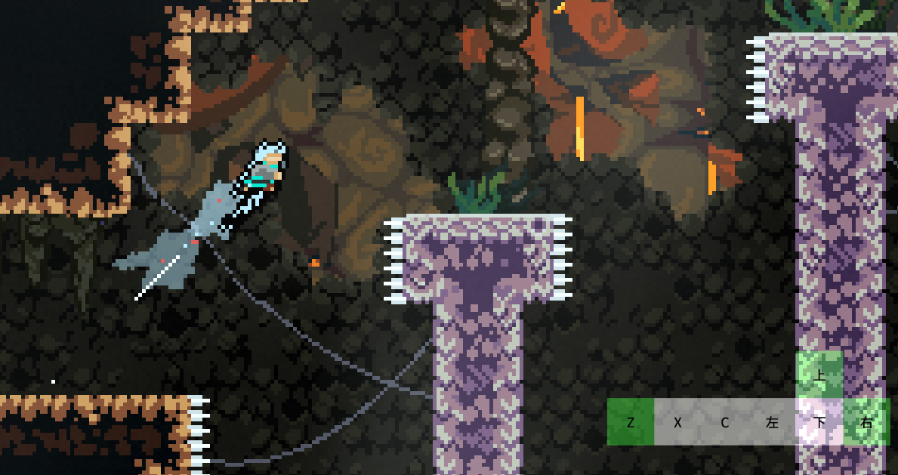

# SalKeyOverlayer

## 简介

这是一个简单的蔚蓝内置的按键显示器, 然后好像没啥了, 具体可以看[CelesteMiaoNet论坛上的这个帖](https://celeste.centralteam.cn/d/81-yi-ge-jian-jian-dan-dan-de-wei-lan-nei-zhi-an-jian-xian-shi-qi)中的介绍(~~虽然也没多少~~)  
~~因为要咕很久~~  
简单的截图:

## 构建

为了方便调试mod, 所以这里使用了vs的生成后事件, 具体命令行为使用`csi`运行`Tasks/on_built.csx`这个c#脚本,
在我的开发环境中我使用的是自己编译的`.net7`的`roslyn`内的`csi`, 难免会遇到不兼容vs自带的`.net framework`版的`csi`,
如果你遇到了这里的问题那么你可以尝试一下自己使用`roslyn`的`csi`源码编译出`.net7`版本, 如果需要的话[这是Roslyn的源码仓库](https://github.com/dotnet/roslyn), [这是它的csi项目的目录](https://github.com/dotnet/roslyn/tree/main/src/Interactive/csi)